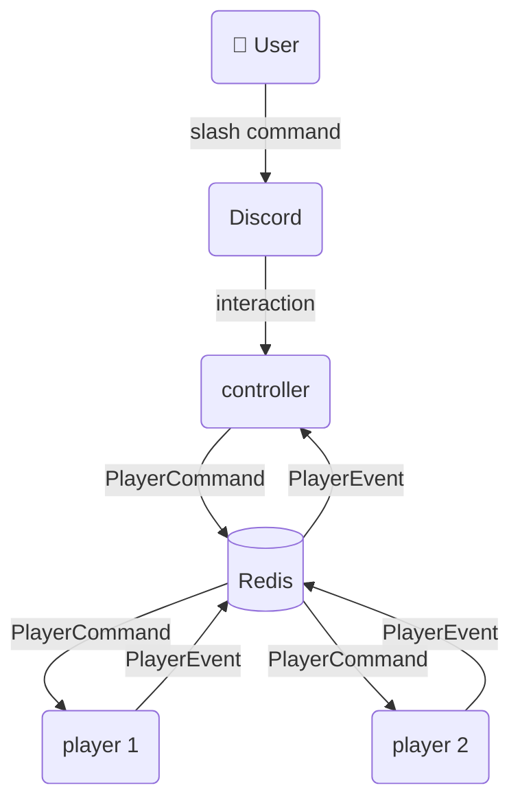

# Bearify Discord Bot

A Discord music bot built with Java 24 and Spring Boot. Uses a controller + player architecture where a main bot handles user commands and separate player agents handle audio playback per voice channel.

## Architecture



- **controller** — the bot users interact with. Receives slash commands and dispatches `PlayerCommand`s to players over Redis.
- **player** — audio player agent. Each instance handles one voice channel. Multiple players can run simultaneously, each with its own Discord bot token.

## Modules

| Module | Description |
|---|---|
| [`discord-api`](discord-api/README.md) | Pure Java interfaces — `DiscordClient`, `CommandInteraction`, `ReplyBuilder` |
| [`discord-starter`](discord-starter/README.md) | Spring Boot auto-configuration — `@Command`, `@Interaction`, `@DiscordControllerAdvice` |
| [`discord-jda`](discord-jda/README.md) | JDA 5 implementation of `discord-api` |
| [`shared`](shared/README.md) | Shared DTOs — `Track`, `PlayerCommand`, `PlayerEvent` |
| [`controller`](controller/README.md) | Main bot application |
| [`player`](player/README.md) | Audio player agent |

## Tech Stack

- Java 24 (Spring Boot 3.4.3 does not support Java 25 yet)
- Spring Boot 3.4.3
- JDA 5.3.0
- LavaPlayer 2.2.2
- Redis (pub/sub + registry)

## Prerequisites

- JDK 24
- Docker (for local Redis + PostgreSQL)

## Getting Started

**1. Start infrastructure:**
```bash
cd infra
docker-compose up -d
```

**2. Configure environment — copy `.env.example` and fill in your values:**
```bash
cp .env.example .env
```

**3. Run the controller:**
```bash
./gradlew :controller:bootRun
```

**4. Run a player:**
```bash
./gradlew :player:bootRun
```

## Building

```bash
./gradlew build
```

> On Windows, set `JAVA_HOME` to your JDK 24 installation before running Gradle.
