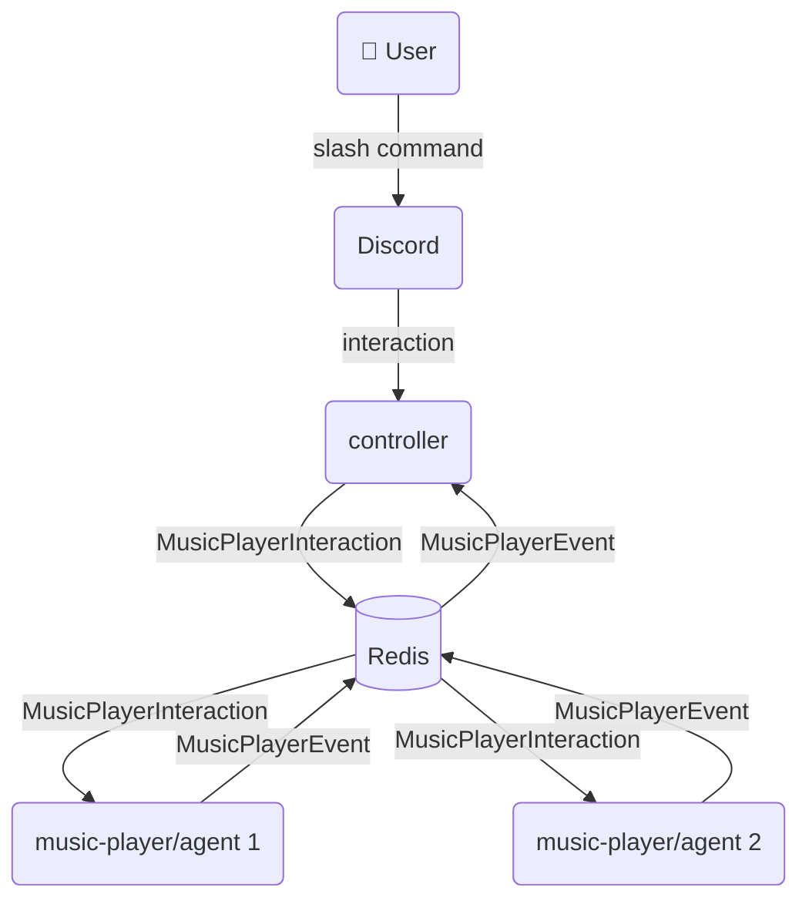

# Bearify Discord Bot

A Discord music bot built with Java 25 and Spring Boot. Uses a controller + player architecture where a main bot handles user commands and separate player agents handle audio playback per guild.

## Architecture



- **controller** — the bot users interact with. Receives slash commands, dispatches `MusicPlayerInteraction`s to player agents over Redis, and posts feedback messages back to Discord text channels when it receives `MusicPlayerEvent`s.
- **music-player/agent** — audio player agent. Each instance can serve multiple guilds simultaneously using LavaPlayer. Multiple agents can run in parallel, each with its own Discord bot token.

## Modules

| Module | Description |
|---|---|
| [`discord/api`](discord/api/README.md) | Pure Java interfaces — `DiscordClient`, `Guild`, `TextChannel`, `AudioProvider`, `CommandInteraction` |
| [`discord/jda`](discord/jda/README.md) | JDA 5 implementation of `discord-api` |
| [`discord/starter`](discord/starter/README.md) | Spring Boot auto-configuration — `@Command`, `@Interaction`, `@Option`, `@DiscordControllerAdvice` |
| [`discord/testing`](discord/testing) | Test doubles — `MockDiscordClient`, `MockCommandInteraction` |
| [`music-player/bridge`](music-player/bridge) | Shared protocol — `MusicPlayerInteraction`, `MusicPlayerEvent`, `Track` |
| [`controller`](controller/README.md) | Main bot application |
| [`music-player/agent`](music-player/agent) | Audio player agent |

## Tech Stack

- Java 25
- Spring Boot 3.4.3
- JDA 5.3.0
- LavaPlayer 2.2.2
- Redis (pub/sub + player registry)

## Prerequisites

- JDK 25
- Docker (for local Redis)

## Getting Started

**1. Start infrastructure:**
```bash
docker-compose -f infra/docker-compose.yml up -d
```

**2. Configure environment — copy `.env.example` and fill in your values:**
```bash
cp .env.example .env
```

**3. Run the controller:**
```bash
./gradlew :controller:bootRun
```

**4. Run a player agent:**
```bash
./gradlew :music-player:agent:bootRun
```

## Building

```bash
./gradlew build
```

> On Windows, set `JAVA_HOME` to your JDK 25 installation before running Gradle.
